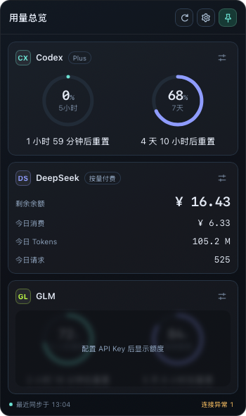
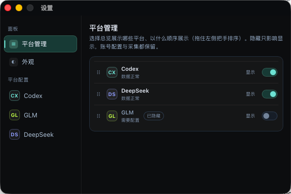
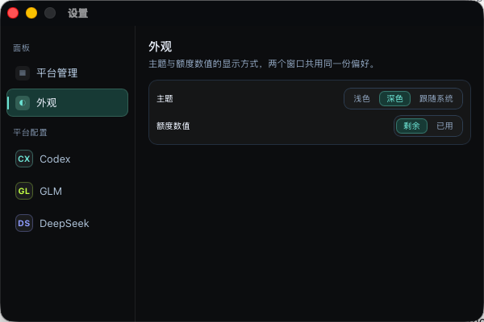
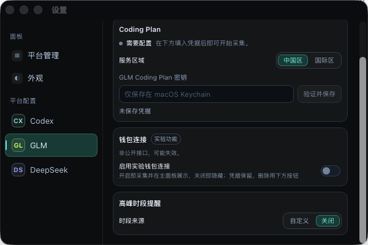
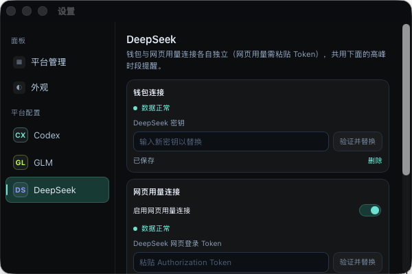
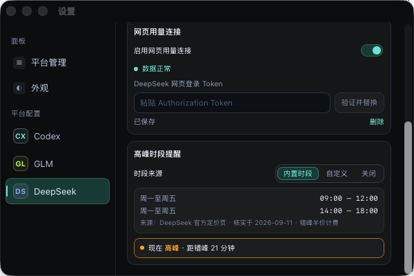
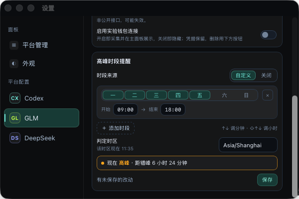

# agents-usage

一个常驻 macOS 菜单栏的**本地用量面板**：把 Codex 订阅额度、GLM Coding Plan 配额、GLM 钱包余额、
DeepSeek 余额与今日消费集中在一块紧凑面板里。所有数据只在本机采集与展示，面板不会调用模型、
不会购买额度，也不会修改任何订阅。

> A local-first usage panel that lives in your macOS menu bar. It reads the quota of your Codex
> subscription, GLM Coding Plan, GLM wallet and DeepSeek balance through read-only endpoints on your
> own machine, stores them in a local SQLite file, keeps credentials in the macOS Keychain, and talks
> to nothing except the providers you configure. No telemetry, no account, no model calls.

<p align="center">
  
</p>

## 功能

- **一眼看清每个平台还能用多少**：总览卡片按平台分区，套餐额度与钱包余额互不折算。
- **配额有形状**：Codex 与 GLM 支持圆环／进度条两种展示，点击即可切换；数值可选“剩余”或“已用”。
- **重置时间双读法**：倒计时与绝对时间随点随切，归零后显示“等待刷新”，不会假装额度已恢复。
- **连接独立**：GLM 套餐、GLM 钱包、DeepSeek 余额、DeepSeek 网页用量各自采集、各自报错，
  一个连接失败不会遮住另一个的数据。
- **无数据时不撒谎**：没有可靠读数就保留模块轮廓并盖上毛玻璃提示，不用 `0` 或占位数字冒充真实
  读数；有缓存时继续显示并标记“已过期”。
- **实验连接一个开关到底**：打开即采集并出现在卡片上，关闭即停止并从卡片消失（凭据保留），
  撤销凭据只由凭据表单里的“删除”按钮完成。
- **高峰时段提醒**：按平台指定高峰时段（内置表或自己定义），命中高峰时那张卡片自己亮出警示描边，
  错峰保持普通外观；自定义编辑器按当前草稿给出“现在 高峰 · 距错峰 2 小时 30 分钟”的判定预览。
- **失败详情在卡片外**：底部连接状态浮层按平台与连接列出失败原因，卡片布局不因错误改变；
  连接自己的状态行就在它的配置区块里，并且每种失败都带一句出路。
- **设置是独立的窗口**：面板顶部的齿轮、卡片上的配置图标、空状态的“管理平台”与菜单栏右键的
  “打开设置”都打开同一个 `600×400` 窗口并直接落在对应分区；改一项，面板当场跟着变。
- **面板窗口跟着内容走**：高度按内容动画调整、超出上限后内部滚动，钉住后可留在所有 Space。

## 截图

面板本身只剩总览一页，约 350 逻辑像素宽、高度由内容决定。下面这张里 DeepSeek 正处于高峰时段，
所以那张卡片带警示描边与高峰角标（错峰时与其它卡片外观一致）：

<p align="center">
  
</p>

设置是一个独立的 `600×400` 窗口（系统标准标题栏）：左侧纵排分类，右侧是唯一的内容滚动区。

| | |
| --- | --- |
|  |  |
| **平台管理**：显隐与排序（拖住左侧把手上下移动），隐藏只影响显示。 | **外观**：主题（浅色／深色／跟随系统）与全局额度数值。 |
|  |  |
| **GLM**：服务区域、Coding Plan 密钥、实验钱包连接。 | **DeepSeek**：余额密钥与实验网页用量连接。 |
|  |  |
| **高峰时段提醒**：时段来源、内置时段表与判定结果。 | **自定义编辑器**：一条时段一张卡片，底下是判定预览与修改状态。 |

截图取自真实运行的 app（凭据本身在 Keychain 里，末四位掩码在截图中也已抹掉）。

## 支持的数据源

| 平台 / 连接 | 数据 | 来源 |
| --- | --- | --- |
| Codex | 五小时与每周窗口的剩余／已用额度、重置时间、计划类型、credits、今日 Tokens | 本机 `codex app-server`，沿用你已有的 Codex 登录 |
| GLM Coding Plan | 五小时、每周、月度工具配额与重置时间 | 所选区域（中国区／国际区）的只读 monitor 接口 |
| GLM 钱包（实验，默认关闭） | 钱包余额 | 非公开稳定接口，端点需自行确认 |
| DeepSeek | 各币种总余额／赠送／充值余额 | 官方 `/user/balance` 只读接口 |
| DeepSeek 网页用量（实验，默认关闭） | 今日账单消费、Tokens、请求次数 | 你粘贴的网页登录 Token 对应的后台用量页 |

## 安装

从 [Releases](https://github.com/Squirt1e/agents-usage/releases) 下载最新的 universal 版 dmg
（例如 `Agents.Usage_1.1.0_universal.dmg`；GitHub 会把文件名里的空格写成点）。它是 Intel 与
Apple Silicon 通用的单一安装包。

1. 打开 dmg，把 `Agents Usage.app` 拖进“应用程序”。
2. 首次启动会被 Gatekeeper 拦下：当前发布包**未做 Apple 公证**。任选一种放行方式：
   ```bash
   xattr -dr com.apple.quarantine "/Applications/Agents Usage.app"
   ```
   或双击后到 **系统设置 → 隐私与安全性**，在底部点 **仍要打开**。
3. 启动后**不会出现在 Dock**：看菜单栏右上角的图标，左键展开／收起面板，右键菜单里可以退出。

## 首次配置

每个平台卡片上都有配置图标，点开就在设置窗口里打开那个平台的分类（面板顶部的齿轮进“外观”，
空状态的“管理平台”和菜单栏图标右键的“打开设置”进“平台管理”）。窗口里改一项，面板当场跟着变。

- **Codex**：先在 Codex 应用或 CLI 里登录。面板把认证完全交给本机的 `codex app-server`，
  不读取也不复制认证文件；找不到 CLI 时可以在配置页填写绝对路径。
- **GLM**：选对中国区／国际区，再粘贴 Coding Plan API Key。新密钥会先用只读请求验证，
  通过后才替换旧值。
- **DeepSeek**：粘贴 API Key，验证只调用官方余额读取接口。
- **高峰时段提醒**（每个平台各自设置）：可以选内置时段表、自己定义时段，或关闭。自定义时段
  一条一张卡片（星期多选 + `开始 → 结束`），跨午夜的那条自己标出“跨天”，底部按当前草稿给出
  此刻是高峰还是错峰。
- **实验连接**（GLM 钱包、DeepSeek 网页用量）：默认关闭，需要自己确认端点可用性再打开。
  打开即采集并出现在卡片上；关闭即停止采集并隐藏模块，**凭据保留**；要撤销凭据用凭据表单里的
  “删除”按钮（点击后先在原地确认一次，确认文案说明后果）。它们使用非公开稳定接口，可能随时失效，
  故障不会影响同平台的稳定连接。

保存凭据或打开实验连接后，面板会立刻重新采集该平台，不需要手动刷新。

## 隐私与安全

- **凭据只进 Keychain**：GLM / DeepSeek 的密钥与实验连接凭据存在 macOS Keychain
  （服务名 `agents-usage.*`），界面只能看到“是否已配置”和末四位掩码。
- **只监听回环地址**：面板数据由一个本地服务提供，只接受 IPv4/IPv6 回环连接，并要求会话令牌。
- **不读浏览器 Cookie**：实验连接需要你自己粘贴凭据，面板不会去翻浏览器的登录态。
- **日志与诊断脱敏**：错误文案、诊断接口与事件推送在离开服务前统一脱敏，原始密钥不会进入日志、
  数据库或面板。
- **没有遥测**：不发送任何统计数据，不请求任何第三方服务；数据目录
  （`~/Library/Application Support/agents-usage/desktop/`）可以随时删除。

## 数据标签

- **平台数据**：来自平台拥有或正式文档描述的只读接口。
- **实验数据源**：来自没有公开稳定契约的接口，可能突然不可用。
- **估算**：由本机观测推导，不等同于账单。
- **部分数据**：当天并非从本地零点开始持续观测，可能漏算离线期间的消费。
- **已过期**：最新采集失败，当前仍展示上一次成功快照。

额度同时保留“已用”和“剩余”语义，不会互相推算。重置时间可以显示为倒计时或绝对时间。
不同币种不会相加或换算，缺失值不会被写成 `0`。

### DeepSeek 今日消费是估算

今日消费等于同一币种当天相邻余额样本正向下降之和；充值、赠送或退款造成的余额上升被当作调整
边界，不产生负消费。服务未运行、网络中断或当天中途才启动，都会漏掉一部分消费，因此该值始终
标记为“估算”，覆盖不完整时再叠加“部分数据”。它适合做预算提醒，不适合作为发票或对账依据。
如果启用了实验的网页用量连接，卡片会优先展示后台账单口径的今日消费。

## 从源码构建

需要 macOS、Node.js 24+、Rust 1.98+（用 `rustup` 安装）与 Xcode Command Line Tools。
Node 只用于前端构建与测试，最终的 app 不依赖 Node 运行。

```bash
npm install
npm test               # 前端与共享契约的测试
npm run typecheck && npm run lint

npm run build:desktop  # 打包 .app 与 .dmg（默认当前架构）
```

打通用二进制（Intel + Apple Silicon）：

```bash
rustup target add aarch64-apple-darwin          # x86_64-apple-darwin 通常已装
npm run build:desktop -- --target universal-apple-darwin
```

产物在 `target/universal-apple-darwin/release/bundle/`。打包流程先构建面板前端
（`dist/desktop-client`，Vite），再编译 `usage-service` 作为 sidecar（`universal` 构建会同时编译
两个架构并用 `lipo` 合并），最后由 Tauri 出包。发布包使用 ad-hoc 签名
（`bundle.macOS.signingIdentity = "-"`），因此对方仍需过一次 Gatekeeper。

### 发布由 GitHub Actions 完成

本地不需要再手工打包上传。推到 `main` 会触发
[`.github/workflows/release.yml`](.github/workflows/release.yml)，它先看 `package.json` 里的
版本发过没有：没发过就用同一条 universal 命令打包，并用仓库里那份已提交的正文建一个公开的
`v<version>` release 挂上 dmg；发过就只跑门禁（`typecheck` / `lint` / `test`），既不出包也不碰
那个 release。

- **一个版本只打一次包**：`v<version>` 这个 tag 或 release 已经存在就算发过，之后的推送只会跑
  门禁。所以 release 上的 dmg 与它 tag 指向的提交是同一份代码，正文里的说明也不会被后来的
  构建悄悄改掉（GitHub 的 immutable releases 开关正是这条规矩的强制版，现在两者不冲突）。
- **版本号只有一处**：`src-tauri/tauri.conf.json` 的 `version` 指向 `../package.json`，打包时
  Tauri 现读它。升版本要改两个文件——`package.json` 与 `Cargo.toml` 的
  `[workspace.package] version`（后者与前者一致由 `tests/release-pipeline.test.ts` 守住）。
- **新版本要连正文一起提交**：正文写在 `docs/release-notes/v<version>.md`，与该版本的版本号在
  同一条提交里，骨架见 [`TEMPLATE.md`](docs/release-notes/TEMPLATE.md)；「这个版本里有什么」只写
  一句话，站在用户视角说这个版本与上一个版本的区别，不列提交。缺了这份文件，流水线在打包之前
  就失败。
- **正文由人写、流水线不写**：流水线只把仓库里那份贴上去，不生成变更列表、不留 draft。也不要写
  校验和——资产页上的 SHA-256 是 GitHub 现算的，写进正文只会多一份会过期的副本。
- **要重发某个版本**（包本身有问题）：`gh release delete v1.2.0 --cleanup-tag --yes` 删掉它的
  release 与 tag，再重跑那次 run，判断会重新变回“要打包”。

Rust 侧的检查与测试：

```bash
npm run rust:check     # cargo check --workspace --all-targets
npm run rust:test      # cargo test --workspace
npm run rust:clippy    # 警告视为错误
```

> `tools/cargo.sh` 把 cargo 缓存指向仓库内的 `.dsh/cargo-home`，在受限环境下也能构建；
> 直接调用 `cargo` 可能因 `~/.cargo` 不可写而失败。

## 项目结构

```
src-tauri/             Tauri 宿主：菜单栏、两个窗口的生命周期、受限命令/事件桥
src/desktop/           前端（React + TS）：panel/ 总览面板与 settings/ 设置窗口分目录，
                       共用组件与纯逻辑在 components/ 与 lib/，HTML 入口与样式留在根上
crates/usage-core/     采集核心：契约、脱敏、Keychain、SQLite 存储、各平台采集器
crates/usage-service/  本地服务：回环 HTTP/SSE、连接级调度与健康记录，打包为 sidecar
src/shared/            前端与服务共享的契约与脱敏（TypeScript）
docs/desktop/          桌面版工程说明：构建、语义对照、组件与样式约定、验收记录
```

工程入口与命令见 [`docs/desktop/README.md`](docs/desktop/README.md)，界面与语义约定见
[`docs/desktop/component-and-style-guide.md`](docs/desktop/component-and-style-guide.md)。

## 已知限制

- 只支持 macOS（菜单栏应用，依赖 Keychain 与 Tauri 宿主）。
- 发布包未做 Apple 公证，首次启动需要手动放行（见“安装”）。
- 实验连接依赖非公开接口，可能随时失效；面板会在对应模块上如实报错，不会伪装成正常数据。
- Codex 卡片需要本机安装并登录 Codex CLI。
- 菜单栏应用不占 Dock，因此设置窗口拿不到键盘焦点，窗口内的键盘操作（时间框的 `↑↓` 步进、
  Escape 取消删除确认）在当前激活策略下可能收不到按键；修它需要先决定是否让菜单栏应用抢占焦点。

## 许可证

[MIT](LICENSE)
