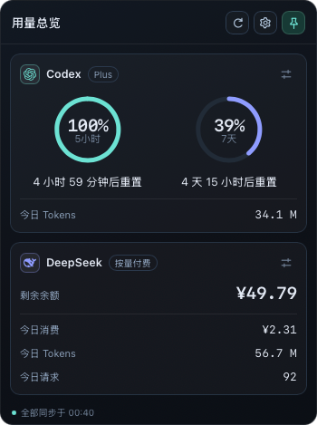
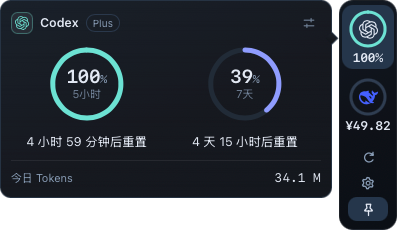
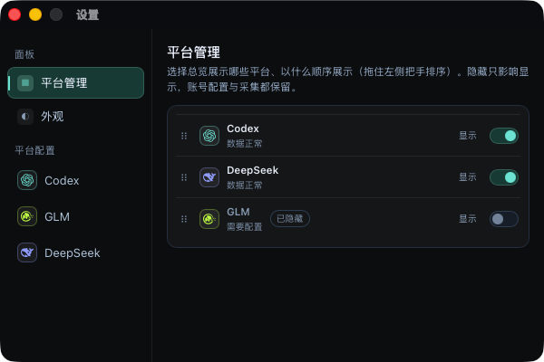
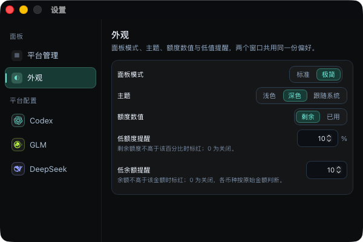

# agents-usage

常驻 macOS 菜单栏的**本地用量面板**：把 Codex 订阅额度、GLM Coding Plan 配额、GLM 钱包余额与
DeepSeek 余额／今日消费集中在一块紧凑面板里。数据只在本机采集与展示，面板不调用模型、不购买额度、
也不修改任何订阅。

> A local-first usage panel for the macOS menu bar: it reads your own Codex, GLM and DeepSeek quotas
> through read-only endpoints on your machine. No telemetry, no account, no model calls.

## 截图

标准模式只有总览一页，约 350 逻辑像素宽、高度由内容决定：

<p align="center">
  
</p>

极简模式（外观 → 面板模式 → 极简）把面板收成屏幕右边缘的一条竖栏：圆环里是平台图标、圆环下只有读数，
指针停在圆环上时卡片从左侧展开：

<p align="center">
  
</p>

设置是一个独立的 `600×400` 窗口（系统标准标题栏）：左侧纵排分类，右侧是唯一的内容滚动区。

| | |
| --- | --- |
|  |  |
| **平台管理**：显隐与排序（拖住左侧把手上下移动），隐藏只影响显示。 | **外观**：面板模式、主题与额度数值、低额度与低余额提醒。 |

截图取自真实运行的 app（凭据本身在 Keychain 里，末四位掩码在截图中也已抹掉）。

## 支持的数据源

| 平台 / 连接 | 数据 | 来源 |
| --- | --- | --- |
| Codex | 五小时与每周窗口的剩余／已用额度、重置时间、计划类型、credits、今日 Tokens | 本机 `codex app-server`，沿用你已有的 Codex 登录 |
| GLM Coding Plan | 五小时、每周、月度工具配额与重置时间 | 所选区域（中国区／国际区）的只读 monitor 接口 |
| GLM 钱包（实验，默认关闭） | 钱包余额 | 非公开稳定接口，端点需自行确认 |
| DeepSeek | 各币种总余额／赠送／充值余额 | 官方 `/user/balance` 只读接口 |
| DeepSeek 网页用量（实验，默认关闭） | 今日账单消费、Tokens、请求次数 | 你粘贴的网页登录 Token 对应的后台用量页 |

## 安装与使用

从 [Releases](https://github.com/Squirt1e/agents-usage/releases) 下载 universal 版 dmg（Intel 与
Apple Silicon 通用的单一安装包），拖进“应用程序”。发布包**未做 Apple 公证**，首次启动任选一种放行：

```bash
xattr -dr com.apple.quarantine "/Applications/Agents Usage.app"
```

或双击后到 **系统设置 → 隐私与安全性** 底部点 **仍要打开**。启动后不会出现在 Dock：点击菜单栏图标
（左右键都行）打开菜单——显示／隐藏面板、切换标准／极简模式与主题、打开设置、重启或退出都在那里。

## 配置

每个平台卡片上都有配置图标，点开就在设置窗口里打开那个平台的分类（面板顶部齿轮进“外观”，空状态的
“管理平台”进“平台管理”）。Codex 需要本机登录 CLI——面板把认证完全交给 `codex app-server`，不读取也
不复制认证文件，找不到 CLI 时可以填绝对路径；GLM 选对中国区／国际区再粘贴 Coding Plan Key；DeepSeek
粘贴 API Key。GLM 钱包与 DeepSeek 网页用量是**实验连接**：默认关闭，需要自己确认端点可用性再打开，
它们走非公开稳定接口、可能随时失效，故障不影响同平台的稳定连接。

## 隐私

凭据只进 Keychain（服务名 `agents-usage.*`，界面只能看到“是否已配置”与末四位）；数据服务只监听回环
地址并要求会话令牌；不读浏览器 Cookie、不发送遥测，数据目录
`~/Library/Application Support/agents-usage/desktop/` 可以随时删除；错误文案、诊断与事件推送在离开
服务前统一脱敏。指标语义（估算、部分数据、已过期等）见
[`docs/desktop/semantic-map.md`](docs/desktop/semantic-map.md)。

## 从源码构建

需要 macOS、Node.js 24+、Rust 1.98+（`rustup`）与 Xcode Command Line Tools。Node 只用于前端构建与
测试，最终的 app 不依赖 Node 运行。

```bash
npm install
npm test && npm run typecheck && npm run lint
npm run build:desktop                                       # 当前架构
npm run build:desktop -- --target universal-apple-darwin    # 通用二进制（Intel + Apple Silicon）
```

Rust 侧的检查与测试：`npm run rust:check` / `rust:test` / `rust:clippy`。产物在
`target/<target>/release/bundle/`，发布包使用 ad-hoc 签名（`bundle.macOS.signingIdentity = "-"`）。

**发版由标签触发**：升 `package.json` 的版本号（`Cargo.toml` 的 workspace 版本跟着改）并写
`docs/release-notes/v<version>.md` 一起推 `main`，再 `git tag v<version> && git push origin v<version>`
才打包发布；推分支只跑门禁。本地不手工打包上传，接线与规矩见 [AGENTS.md](AGENTS.md) §4。

## 项目结构

```
src-tauri/             Tauri 宿主：菜单栏、两个窗口的生命周期、受限命令/事件桥
src/desktop/           前端（React + TS）：panel/ 总览面板与 settings/ 设置窗口分目录，
                       共用组件与纯逻辑在 components/ 与 lib/，HTML 入口与样式留在根上
crates/usage-core/     采集核心：契约、脱敏、Keychain、SQLite 存储、各平台采集器
crates/usage-service/  本地服务：回环 HTTP/SSE、连接级调度与健康记录，打包为 sidecar
src/shared/            前端与服务共享的契约与脱敏（TypeScript）
docs/desktop/          桌面版工程说明：构建、语义对照、组件与样式约定、验收记录
```

工程入口与命令见 [`docs/desktop/README.md`](docs/desktop/README.md)，界面与样式约定见
[`docs/desktop/component-and-style-guide.md`](docs/desktop/component-and-style-guide.md)。

## 已知限制

- 只支持 macOS（菜单栏应用，依赖 Keychain 与 Tauri 宿主）。
- 发布包未做 Apple 公证，首次启动需要手动放行。
- 实验连接依赖非公开接口，可能随时失效；面板会如实报错，不会伪装成正常数据。
- Codex 卡片需要本机安装并登录 Codex CLI。
- 菜单栏应用不占 Dock，因此设置窗口拿不到键盘焦点，窗口内的键盘操作（时间框的 `↑↓` 步进、
  Escape 取消删除确认）在当前激活策略下可能收不到按键。

## 许可证

[MIT](LICENSE)
